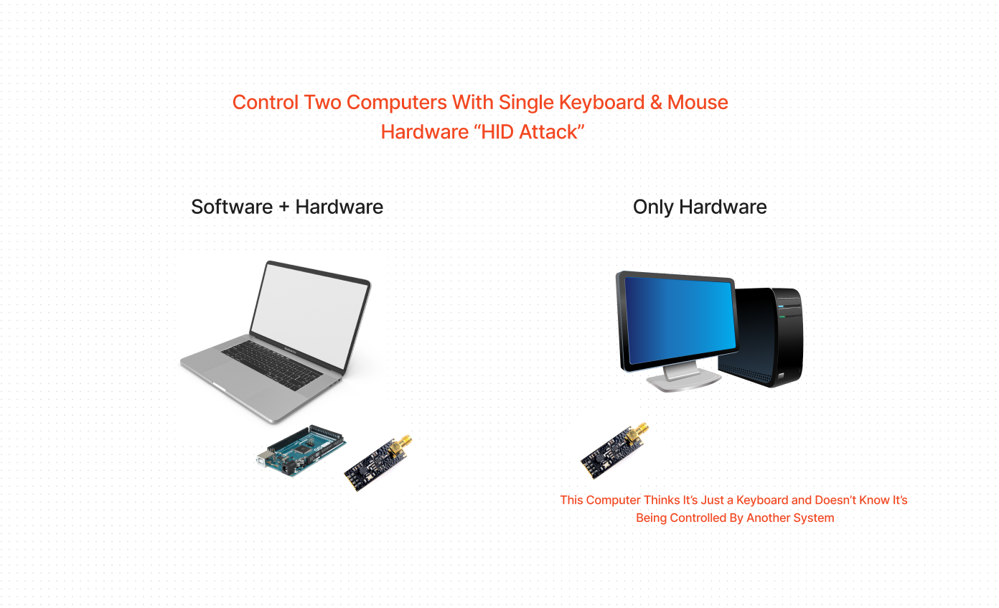
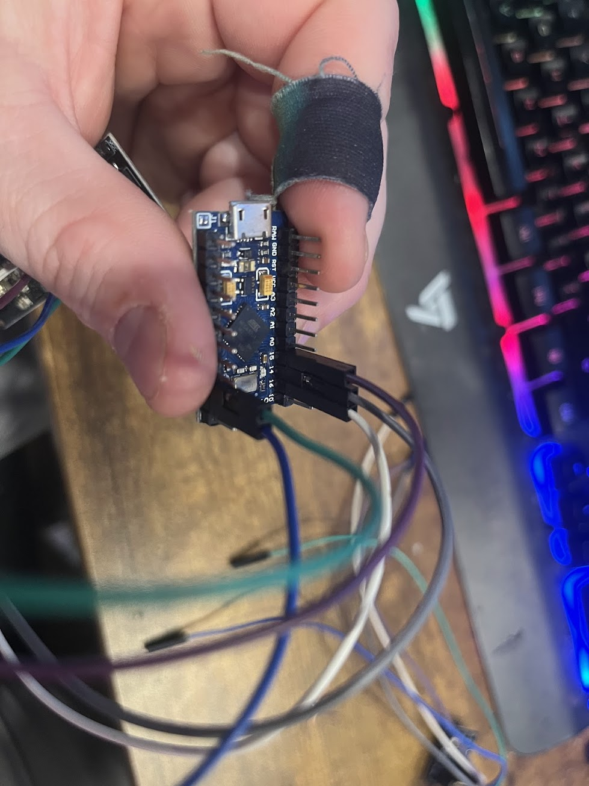
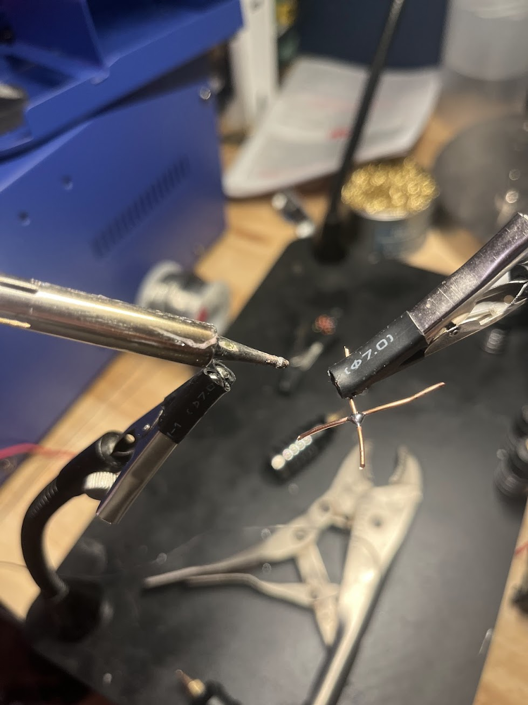
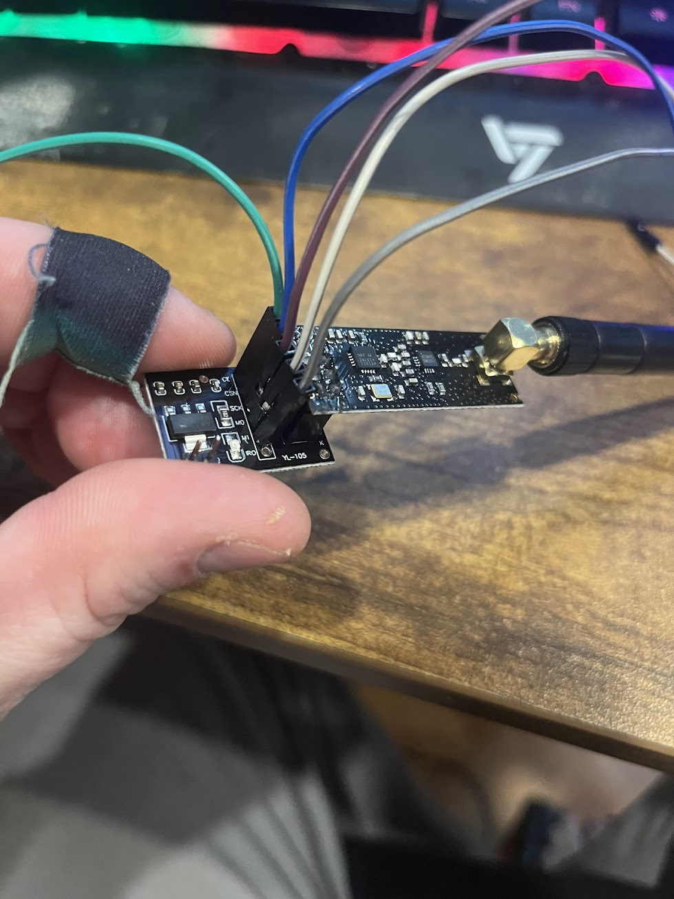
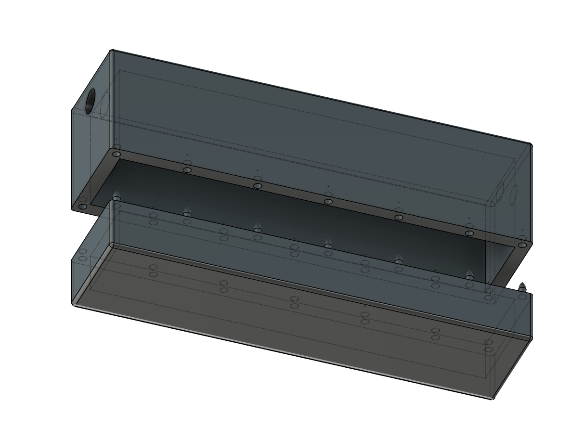

# The "HID Attack" To Wirelessly Control 2 Computers using 1 Mouse & Keyboard 
Created by [Joey Sanchez](https://github.com/joecodecreations)

1. [Introduction](#hardware-hid-attack-to-control-2-computers)
2. [What You Can Do with This Project](#what-you-can-do-with-this-project)
3. [Use Cases](#use-cases)
4. [Wiring](#wiring)
5. [Installation](#installation)
6. [Setup](#setup)
6. [Running the Software](#running-the-software)
7. [Testing Wireless / Debug](#testing-wireless-independently)
8. [3D printed Container](#3d-printed-container)

# Introduction

A hardware based approach to microsoft's "mouse without borders" where you can control two computers using a single keyboard and mouse but...it doesn't have to be windows and you don't need to run software on one of the computers.




## What you can do with this project

With this project, you can use software on a single system and then use two physical devices to control two computers. 

This leverages HID or human interface device attack vector to wirelessly transmit keystrokes and mouse movements to another computer. 

To accomplish this, we leverage two **ATMEGA32U4**s that can act as an HID, in combination with two **NRF24L01**s to provide wireless connectivity between the two devices. 

One ATMEGA32U4 can connect to your host machine via serial and get commands from a python script we have running which receives serial communication to the main ATMEGA32U4 which in turn, sends commands to the secondary ATMEGA32U4 via wireless over the **NRF24L01** and then allows keyboard and mouse control over a secondary system. 

The best part? The secondary computer doesn't know it's being controlled remotely since it "Trusts" the USB input as a keyboard device.

## Use Cases

1. While you can use [mouse without borders from miscrosoft](https://github.com/microsoft/PowerToys) between two windows machines, you cannot as easily control windows + linux or windows + mac combinations with that. *This* will work between *any* OS.

2. Due to security constraints, you may not be able to run software for sharing mice and keyboards on certain computers. Using this project, as long as you have a single computer you can control, this will allow you to control the ***other*** safely.


## Wiring 

First make sure you pick up 2 [NRF2401](https://www.amazon.com/dp/B08R9F11D1?ref=ppx_yo2ov_dt_b_fed_asin_title)s and two [ATmega32U4](https://www.amazon.com/dp/B08CC24JRS?ref=ppx_yo2ov_dt_b_fed_asin_title)s from your preferred electronics dealer.


You'll want to wire it up. I've color corrdinated for you to make it easier to seee my pictures. 

But basically the mapping is 

```
ATmega32U4 pins --- NRF2401 pins

pin 7   --- ce (green)
pin 8   --- csn (blue)
pin 15  --- sck (purple)
pin 16  --- mosi (white)
pin 14  --- Miso (grey)

```

I really appreciate the breakout board for the NRF2401. I also have some power supply regulators since I hear that the NRF2401 is really critical to use 3.5v with but requires higher amps than an arduino or ATmega32U4 could provide. 

**Here's the ATMEGA32U4 wired up:**




**Make sure you share ground!**

Make sure you have the ATMEGA32U4 and the NRF2401 sharing grounds between the two units or else it may not know the correct baseline for the wireless signals coming in. 



**NRF24L01 wiring**



# Installation

1. Run `pip install -r requirements.txt` to install the requirements

2. load `tx.ino` on one of the ATMEGA32U4s and `rx.ino` on the other. 

    You can use `Arduino` software to do this. 

# Setup

1. Open `app.py` and change your `target_system` to whatever you're going to control wirelessly (windows, mac, linux)

2. Update `host_system` to reflect whatever OS you'll be running this script on 


# Running the software 

run `python app.py` to kick things off. Then, you'll notice that when you take your cursor to the right side of the screen that it will start piping commands via serial to the tx.ino arduino.

When you come back the other direction, it will turn it off. 

## Running Indicator


You'll notice an indicator in the bottom right of your **host** system that indicates when the 
keyboard and mouse should be activated on your **target** system.

The dot is green but feel free to search `green` in the `app.py` and change it to `blue` or `red` or whatever.

## Operations
When you're controlling the other computer, you should be able to have full control of keyboard and mouse with all the mappings between systems working. 

For instance, if you've set your `target_system = "mac"` and your `host_system = "windows"`, when you hold `[left windows key]` + `[a]` it will `select all` on your target system.


# Testing Wireless Independently

To test the wireless is actually working correctly, you can install the alternative `.ino` files to test. RX on one mega and TX on the other (found in the comTests folder)

# 3D Printed Container

Okay, so now you have your hardware wired up, your software hopefully working and you'd like to put this in a container. I went ahead and included an STL file for the top and bottom of a container I created to house these. 


The dimensions of this container is 

`40mm Height` X `22mm Width` X `112 Length` 

I has a 6mm hole for the cord and a 7mm hole for the antennea  

You can find these files in the `3d_files` folder

The sliced files are for a resin 3D printer but you can use the `.stl` files to import and slice with whatever software. 

There's also .obj files if you want to plop them somewhere to edit. 


